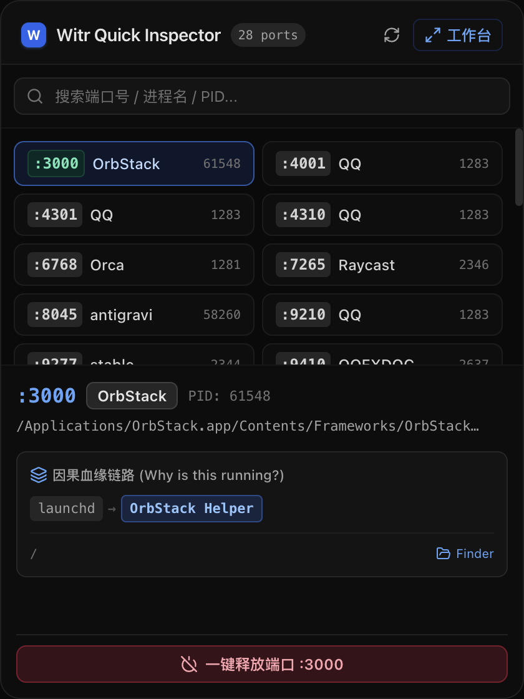

<p align="center">
  
</p>

<h1 align="center">Witr GUI 🖥️⚡</h1>

<p align="center">
  <strong>现代化可视化全链路进程因果血缘追溯与智能端口排障工作台</strong><br>
  Powered by <a href="https://github.com/pranshuparmar/witr">witr</a> (<em>"Why is this running?"</em>)
</p>

<p align="center">
  
</p>

<p align="center">
  <a href="https://github.com/ManTouMT/witr-gui/releases/tag/v0.1.1"></a>
  
  
  
  
  
  
</p>

<p align="center">
  <b>🇨🇳 简体中文</b> • <a href="README_EN.md"><b>English</b></a>
</p>

---

`witr-gui` 是专为 macOS 和现代化开发者打造的**系统级进程因果追溯与智能端口排障工作台**。

告别晦涩的 `lsof -i :3000`、`netstat` 和漫无目的的 `kill -9`。`witr-gui` 将进程与端口的黑盒状态转化为直观的**双向因果家族树**、**交互式拓扑图**与**全景运行详情**，帮助你在 1 秒内回答：**“这个端口被谁占用了？它是怎么启动的？它的父进程与衍生子进程都是谁？我能不能安全释放它？”**

---

## 📥 客户端直接下载与安装（终端用户）

> 💡 **无需手动配置环境或从源码构建**，直接下载对应架构的安装包即可开箱即用：

| 硬件架构 | 安装包格式 | 一键下载链接 |
| :--- | :--- | :--- |
| 🍏 **Apple Silicon (M1 / M2 / M3 / M4)** | **DMG 安装镜像 (推荐)** | [**`Witr.GUI-0.1.1-arm64.dmg`**](https://github.com/ManTouMT/witr-gui/releases/download/v0.1.1/Witr.GUI-0.1.1-arm64.dmg) |
| 🍏 **Apple Silicon (M1 / M2 / M3 / M4)** | **绿色免安装 Zip** | [**`Witr.GUI-0.1.1-arm64-mac.zip`**](https://github.com/ManTouMT/witr-gui/releases/download/v0.1.1/Witr.GUI-0.1.1-arm64-mac.zip) |
| 🖥️ **Intel Mac (x64)** | **DMG 安装镜像** | [**`Witr.GUI-0.1.1.dmg`**](https://github.com/ManTouMT/witr-gui/releases/download/v0.1.1/Witr.GUI-0.1.1.dmg) |
| 🖥️ **Intel Mac (x64)** | **绿色免安装 Zip** | [**`Witr.GUI-0.1.1-mac.zip`**](https://github.com/ManTouMT/witr-gui/releases/download/v0.1.1/Witr.GUI-0.1.1-mac.zip) |

> [!TIP]
> **内置完整引擎**：`witr-gui` 已经内置了完全自包含的 `witr` 高性能底层二进制文件，无需预先安装 Homebrew、Go、Python 或 Node.js。
>
> **macOS 首次打开安全提示**：如遇到 macOS 提示 *“无法打开，因为无法验证开发者”*，只需前往 **系统设置 $\to$ 隐私与安全性** 点击 **“仍要打开”**（或在访达中按住 Control 键右键点击应用图标选择 **打开**）即可。

---

## ✨ 核心特性与典型场景

### 1. ⚡ 双模态交互架构（快捷菜单栏 + 深度工作台）

<p align="center">
  
</p>

* **极速菜单栏弹窗 (`⌥ + W`)**：
  - **典型场景**：本地前端开发启动时提示 `:5173` 或 `:3000` 端口冲突。按下 `⌥ + W` 呼出 1 秒轻量弹窗，直接悬浮点击 **`⚡ 释放端口`**，无需离开编辑器中断心流。
* **全景排障工作台 (`⌘ + ⇧ + W`)**：
  - **典型场景**：面对内存泄漏、僵尸进程排查或复杂微服务集群，呼出大屏工作台进行双向血缘溯源与网络套接字剖析。

---

### 2. 🌲 全量系统进程嗅探与双向因果家族树

<p align="center">
  
</p>

* **全量系统进程极速索引**：
  - 支持按 **内存占用 (Mem%)**、**CPU 负载**、**PID 序号**、**进程名称** 实时 4 维排序与秒级模糊过滤（例如搜索 `qq` 即刻捕捉主进程及所有 14+ 个 Helper / Renderer 派生子进程）。
* **⬆️ 目标进程置顶与向上溯源（谁启动了它？）**：
  - 目标进程置顶展示，向下逐级向上回溯调用链条：`launchd (PID 1) → iTerm2 → zsh → pnpm dev → vite`，并支持点击任意祖先卡片直接切换聚焦。
* **⬇️ 衍生子进程分支树（它孵化了什么？）**：
  - 自动展开子进程树，针对 800+ 巨型子进程池提供智能懒加载与按需展开，杜绝界面卡顿。
* **🛡️ 启发式安全诊断中文化**：
  - 自动识别“监听公网接口风险”、“物理内存 >1GB”、“特权端口监听”等系统隐患并给出中文建议。

---

### 3. 🕸️ 交互式 React Flow 拓扑画布

<p align="center">
  
</p>

* **无限矢量网络拓扑**：
  - 基于 `@xyflow/react` 打造，支持平移、缩放与节点高亮，清晰呈现进程与微服务节点之间的因果依赖网。
* **多容器与微服务联动感知**：
  - 直观呈现 Docker 容器、PM2 进程与系统守护进程（launchd / systemd）的拓扑关系。

---

### 4. 🔍 智能源码工程识别与一键直达

* **智能工程探测器（Smart Workspace Detector）**：
  - 自动嗅探工作目录中的 `package.json`、`go.mod`、`Cargo.toml`、`pyproject.toml`、`pom.xml` 或 `.git`。
  - **代码工程**：自动打上技术栈标签（`⚡ Next.js`、`🟢 Vite`、`🦀 Rust` 等），并点亮 **`[<> VS Code]`** 源码直达按钮；
  - **桌面应用/系统沙盒（如 QQ、WeChat）**：自动隐藏代码按钮，转换为 **`[📁 访达定位沙盒]`**，符合用户直觉。

---

### 5. 🎯 严格对齐与一键复制详情面板

* **双列环境变量网格**：
  - 采用固定 Key 宽度的网格排版，保证所有 Value 绝对同一起点对齐，支持变量名、变量值及整行独立一键复制。
* **网络连接（Sockets）全景卡片**：
  - `[协议]` 置顶第一列，`[端口]` 与 `[状态]`（`LISTEN` / `ESTABLISHED` / `CLOSE_WAIT`）绝对固定宽度严丝合缝对齐。
* **120Hz 丝滑拖拽缩放**：
  - 底层基于 CSS 变量与 `requestAnimationFrame` 驱动，拖拽侧边栏与底部面板完全零 React 渲染开销，操作流畅如丝。

---

## ⌨️ 常用全局快捷键

| 快捷键 | 功能描述 | 适用窗口 |
| :--- | :--- | :--- |
| **`⌥ + W`** (`Option + W`) | 呼出 / 隐藏顶部菜单栏极速端口释放面板 | 全局任意界面 |
| **`⌘ + ⇧ + W`** (`Cmd + Shift + W`) | 打开全景排障工作台主窗口 | 全局任意界面 |
| **`⌘ + R`** | 强制刷新当前端口与进程快照 | 工作台窗口 |
| **`Esc`** | 快速关闭菜单与模态弹窗 | 工作台窗口 |

---

## 🛠️ 本地开发与构建指南（贡献者）

如果你希望基于本项目进行二次开发或参与贡献：

### 1. 环境准备
* **Node.js**: >= 18.0.0
* **包管理器**: [pnpm](https://pnpm.io/) >= 8.0.0

### 2. 克隆与安装依赖
```bash
git clone https://github.com/ManTouMT/witr-gui.git
cd witr-gui
pnpm install
```

### 3. 本地热更新调试
```bash
pnpm dev
```

### 4. 生产包打包构建
```bash
# 自动执行 TypeScript 强类型校验与打包构建
pnpm run build

# 打包 macOS 全架构分发包 (DMG & Zip)
pnpm run build:mac
```

---

## 🤝 开源致谢与许可协议

* 底层因果追溯引擎基于 [pranshuparmar/witr](https://github.com/pranshuparmar/witr)（遵循 MIT 开源许可）。
* UI 界面与架构由 [ManTou](https://github.com/ManTouMT) 精心打磨。
* 本项目采用 **[MIT 许可协议](LICENSE)** 开源，欢迎提交 Issue 与 Pull Request！
