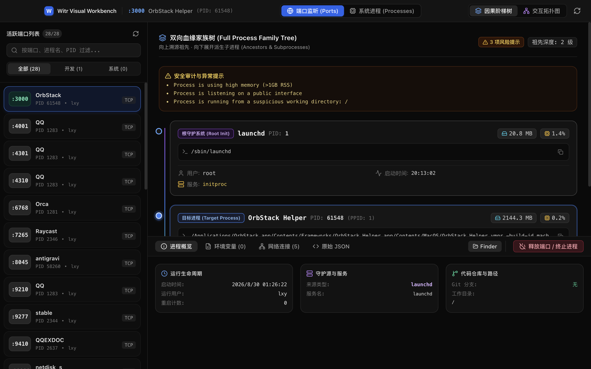

# Witr GUI 🖥️⚡

<p align="center">
  
</p>

<p align="center">
  <strong>Visual Causal Process & Port Inspector</strong><br>
  Powered by <a href="https://github.com/pranshuparmar/witr">witr</a> (<em>"Why is this running?"</em>)
</p>

<p align="center">
  <a href="https://github.com/ManTouMT/witr-gui/releases/tag/v0.1.0"></a>
  
  
  
  
  
  
</p>

<p align="center">
  <a href="README.md"><b>🇨🇳 简体中文</b></a> • <b>English</b>
</p>

---

`witr-gui` is a modern desktop system inspector built for macOS and developers.

Say goodbye to cryptic `lsof -i :3000`, `netstat`, and blind `kill -9` commands. `witr-gui` transforms black-box processes and ports into an intuitive **bidirectional causal family tree**, **interactive topology graph**, and **deep diagnostic workbench**, answering in 1 second: **"Who is occupying this port? How was it started? What are its parents and spawned children? Can I safely terminate it?"**

---

## 📥 Direct Download & Installation (End Users)

> 💡 **No compilation required**. Download pre-compiled, fully self-contained packages:

| Architecture | Installer Format | Download Link |
| :--- | :--- | :--- |
| 🍏 **Apple Silicon (M1 / M2 / M3 / M4)** | **DMG Installer (Recommended)** | [**`Witr.GUI-0.1.0-arm64.dmg`**](https://github.com/ManTouMT/witr-gui/releases/download/v0.1.0/Witr.GUI-0.1.0-arm64.dmg) |
| 🍏 **Apple Silicon (M1 / M2 / M3 / M4)** | **Portable Zip** | [**`Witr.GUI-0.1.0-arm64-mac.zip`**](https://github.com/ManTouMT/witr-gui/releases/download/v0.1.0/Witr.GUI-0.1.0-arm64-mac.zip) |
| 🖥️ **Intel Mac (x64)** | **DMG Installer** | [**`Witr.GUI-0.1.0.dmg`**](https://github.com/ManTouMT/witr-gui/releases/download/v0.1.0/Witr.GUI-0.1.0.dmg) |
| 🖥️ **Intel Mac (x64)** | **Portable Zip** | [**`Witr.GUI-0.1.0-mac.zip`**](https://github.com/ManTouMT/witr-gui/releases/download/v0.1.0/Witr.GUI-0.1.0-mac.zip) |

> [!TIP]
> **Bundled Binary**: `witr-gui` embeds a pre-built standalone `witr` binary. You do not need to install Go, Python, Node.js, or Homebrew.
>
> **macOS Security Gatekeeper Tip**: If macOS reports *"cannot be opened because it is from an unidentified developer"*, open **System Settings $\to$ Privacy & Security** and click **"Open Anyway"** (or right-click the app in Finder and select **Open**).

---

## ✨ Features & Visual Walkthrough

### 1. ⚡ Dual-Mode UX Architecture

<p align="center">
  
</p>

* **MenuBar Popover (`⌥ + W`)**:
  - *Scenario*: Port `:5173` or `:3000` is blocked by a lingering dev server. Hit `⌥ + W`, search for the port, and click **`⚡ Release Port`** in 1 second without leaving your IDE.
* **Visual Workbench (`Cmd+Shift+W`)**:
  - *Scenario*: Deep diagnostic sessions with full ancestry trees, network socket lists, environment variables, and topology canvases.

---

### 2. 🌲 Full System Processes & Bidirectional Family Tree

<p align="center">
  
</p>

* **System-Wide Process Explorer**:
  - 4-way sorting by **Memory (Mem%)**, **CPU Load**, **PID**, and **Name** with instant search (e.g. searching `qq` immediately exposes 14+ helper/renderer subprocesses).
* **⬆️ Target Process on Top & Upstream Ancestry (Who started it?)**:
  - Traces parent execution chains: `launchd (PID 1) → iTerm2 → zsh → pnpm dev → vite`. Click any ancestor to focus and inspect.
* **⬇️ Downstream Subprocesses (What did it spawn?)**:
  - Tree-indented child processes with automatic lazy rendering and pagination for 800+ child process pools (e.g. `launchd`).

---

### 3. 🕸️ Interactive React Flow Topology Graph

<p align="center">
  
</p>

* High-performance vector canvas powered by `@xyflow/react` for complex microservices clusters, daemon hierarchies, and multi-container topologies.

---

### 4. 🔍 Smart Workspace & Framework Detection

* Automatically inspects working directories for `package.json`, `go.mod`, `Cargo.toml`, `pyproject.toml`, `.git`, etc.
* **Code Projects**: Displays framework tags (`⚡ Next.js`, `🟢 Vite`, `🦀 Rust`) and lights up **`[<> VS Code]`** and **`[>_ Cursor]`** shortcuts.
* **App Sandboxes (e.g. QQ, WeChat)**: Automatically switches to **`[📁 Finder Sandbox]`**, preventing confusion.

---

### 5. 🎯 Strictly Aligned Detail Panel & 120Hz Smooth Resizing

* **Double-Column Environment Variables**: Fixed-width keys ensure strict horizontal value alignment with 1-click copy.
* **Network Sockets Grid**: Protocol placed first, with fixed-width port and status badges (`LISTEN`, `ESTABLISHED`, `CLOSE_WAIT`).
* **120Hz Zero-Lag Resizing**: Driven by CSS custom properties and `requestAnimationFrame` for buttery-smooth split-pane adjustments.

---

## ⌨️ Shortcuts

| Shortcut | Description | Window |
| :--- | :--- | :--- |
| **`⌥ + W`** (`Option + W`) | Toggle MenuBar quick release popover | Global |
| **`⌘ + ⇧ + W`** (`Cmd + Shift + W`) | Open full Visual Workbench window | Global |
| **`⌘ + R`** | Force refresh ports and processes snapshot | Workbench |
| **`Esc`** | Dismiss popover or modals | Workbench |

---

## 🛠️ Development & Building (Contributors)

```bash
# Install dependencies
pnpm install

# Start development with hot reload
pnpm dev

# Build production bundle
pnpm run build

# Package macOS DMG & Zip
pnpm run build:mac
```

---

## 🤝 Acknowledgements & License

* Engine powered by [pranshuparmar/witr](https://github.com/pranshuparmar/witr) (MIT License).
* Built with ❤️ by [ManTou](https://github.com/ManTouMT).
* Licensed under the **[MIT License](LICENSE)**.
