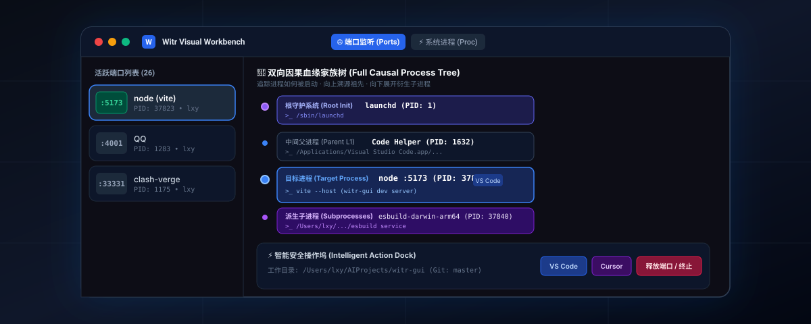
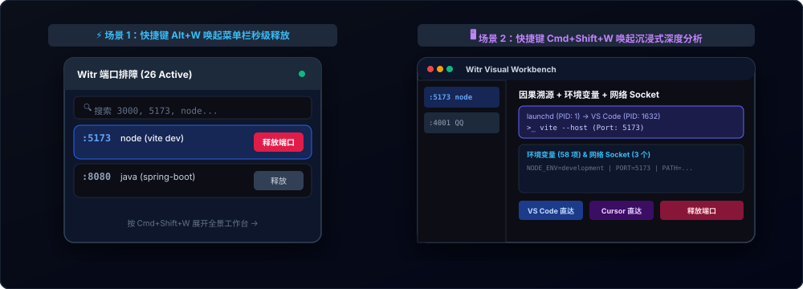
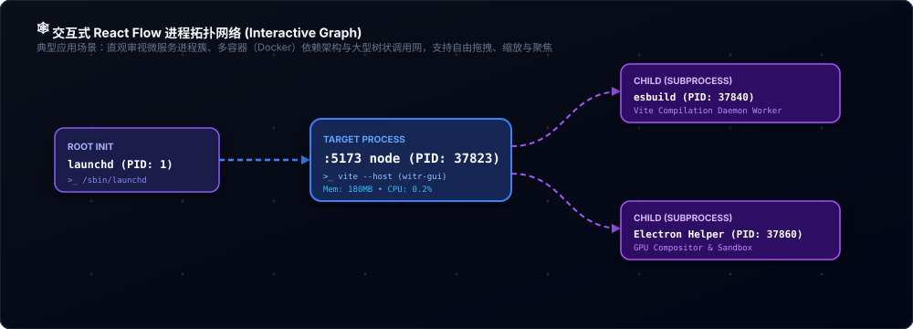
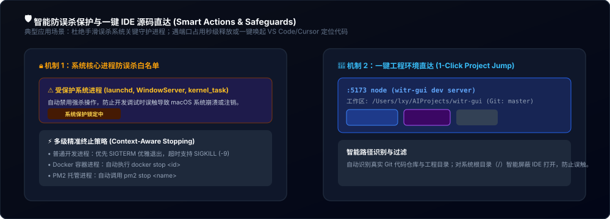

# Witr GUI 🖥️⚡

<p align="center">
  
</p>

<p align="center">
  <strong>可视化因果血缘进程与端口排障工作台</strong> — 基于 <a href="https://github.com/pranshuparmar/witr">witr</a> 深度驱动（回答：<em>“这个进程究竟因何而生？”</em>）
</p>

<p align="center">
  <a href="https://github.com/ManTouMT/witr-gui/releases/tag/v0.1.0"></a>
  
  
  
  
  
  
</p>

<p align="center">
  <a href="README.md"><b>English</b></a> • <a href="README_zh.md"><b>🇨🇳 简体中文</b></a>
</p>

---

`witr-gui` 是一款专为 macOS 及跨平台开发者打造的现代化进程与端口可视化排障工具。它将原本晦涩繁琐的 `lsof -i`、`ps` 和 `kill -9` 命令行排查，升维为**直观可视、秒级溯源、双向血缘展开与智能释放**的沉浸式工作台。

---

## 📥 一键下载与安装 (普通用户)

你**无需**在本地配置 Node.js、Go 或自行编译源码。直接下载已构建完毕的独立安装包即可：

| 适用芯片架构 | 安装包格式 | 直接下载直链 |
| :--- | :--- | :--- |
| 🍏 **Apple Silicon (M1 / M2 / M3 / M4)** | **DMG 安装包** | [**`Witr.GUI-0.1.0-arm64.dmg`**](https://github.com/ManTouMT/witr-gui/releases/download/v0.1.0/Witr.GUI-0.1.0-arm64.dmg) |
| 🍏 **Apple Silicon (M1 / M2 / M3 / M4)** | **绿色便携包 (Zip)** | [**`Witr.GUI-0.1.0-arm64-mac.zip`**](https://github.com/ManTouMT/witr-gui/releases/download/v0.1.0/Witr.GUI-0.1.0-arm64-mac.zip) |
| 🖥️ **Intel Mac (x64 架构)** | **DMG 安装包** | [**`Witr.GUI-0.1.0.dmg`**](https://github.com/ManTouMT/witr-gui/releases/download/v0.1.0/Witr.GUI-0.1.0.dmg) |
| 🖥️ **Intel Mac (x64 架构)** | **绿色便携包 (Zip)** | [**`Witr.GUI-0.1.0-mac.zip`**](https://github.com/ManTouMT/witr-gui/releases/download/v0.1.0/Witr.GUI-0.1.0-mac.zip) |

> [!NOTE]
> **100% 开箱即用（Zero-Config）**：安装包内已内置预编译好的 6.5MB 单二进制 `witr` 引擎。你的电脑无需提前安装 Homebrew，下载后双击即可直接使用。
>
> **macOS 首次打开提示（Gatekeeper）**：由于本工具为开源分发（未购买苹果商业开发者签名），首次打开若系统提示 *“无法验证开发者”*，只需前往 **「系统设置 $\to$ 隐私与安全性」** 点击 **「仍要打开」**（或在访达中 **右键点击 App $\to$ 选择「打开」**）即可永久正常运行。

---

## ✨ 核心特性与典型应用场景

### 1. ⚡ 动静结合的双模架构 (Dual-Mode UX)

<p align="center">
  
</p>

* **菜单栏极速气泡 (`Alt + W`)**：
  - *典型场景*：日常编码时本地 `5173` 或 `3000` 端口突发冲突，按 `Alt+W` 在屏幕右上角唤出极轻量气泡，1 秒内完成检索并点击“释放端口”，完全不打断前台编码心流。
* **全景因果工作台 (`Cmd + Shift + W`)**：
  - *典型场景*：遭遇顽固服务、复杂依赖、环境变量泄露或未知后台服务时，打开大窗口进行全维度因果审查与拓扑分析。

---

### 2. 🌲 双向完整血缘家族树 (Full Process Family Tree)

<p align="center">
  
</p>

* **⬆️ 向上溯源祖先（Ancestors）：回答“谁启动了它？”**
  - 自动向上追溯进程树：`launchd (PID 1) → IDE / 终端窗口 → 目标服务`，精准识别是哪个项目、哪个任务触发了该进程。
* **⬇️ 向下展开子孙（Subprocesses）：回答“它孵化了什么？”**
  - 自动递归嗅探由目标进程（如 Chrome、QQ、Electron）派生出的全部 Helper 渲染、工作与 GPU 子进程，并展示每个子进程的 PID、内存占有率与完整 CLI 命令。

---

### 3. 🕸️ 交互式 React Flow 进程拓扑网络

<p align="center">
  
</p>

* **基于 `@xyflow/react` 的高帧率拓扑画布**：
  - 支持对进程依赖网络进行自由平移、缩放、聚焦与框选。
  - *典型场景*：审视复杂多容器微服务组（Docker）、多进程编译后台（Vite/esbuild）或排查父子进程依赖拓扑。

---

### 4. 🛡️ 智能防误杀保护与 1 键 IDE 源码直达

<p align="center">
  
</p>

* **系统关键守护进程白名单**：
  - 对 macOS 核心守护进程（`launchd`、`WindowServer`、`kernel_task` 等）自动上锁保护，杜绝误杀导致系统注销或崩溃。
* **多级精准终止策略**：
  - 优先通过 `SIGTERM` 发送优雅退出信号，必要时支持 `SIGKILL (-9)` 强制结束；原生联动 `docker stop` 与 `pm2 stop`。
* **工程工作区智能直达**：
  - 自动识别真实 Git 仓库与工程源码路径，支持一键在 **VS Code**、**Cursor** 或 **Finder** 中秒级定位代码目录（对系统根目录 `/` 智能隐藏，防误触）。

---

## 🛠️ 开发者指南 (本地开发与源码构建)

如果你是开源开发者，想要参与贡献或在本地二次开发构建：

### 环境要求
- Node.js 18+
- pnpm 9+
- macOS 环境（推荐）

### 本地编译步骤

```bash
# 1. 克隆代码仓库
git clone https://github.com/ManTouMT/witr-gui.git
cd witr-gui

# 2. 安装项目依赖
pnpm install

# 3. 启动本地热重载开发模式
pnpm dev

# 4. 构建打包 macOS 原生 DMG 与 ZIP 安装包
pnpm build:mac
```

---

## 🏛️ 项目目录架构

```text
src/
├── main/             # Electron 主进程
│   ├── engine/       # 端口扫描器 (lsof)、全量进程嗅探器 (ps)、Witr 引擎桥接、防误杀守护
│   └── windows/      # 菜单栏气泡窗口与全功能工作台窗口管理器
├── preload/          # ContextBridge 类型安全 IPC 桥接层
├── shared/           # 前后端共享数据模型与 IPC 通道常量
└── renderer/         # React 19 渲染层
    ├── components/   # 气泡视图、工作台、因果树、React Flow 拓扑图、详情面板
    └── stores/       # Zustand 5 响应式前端状态机
```

---

## 📄 开源许可证

本项目基于 **MIT License** 开源。
